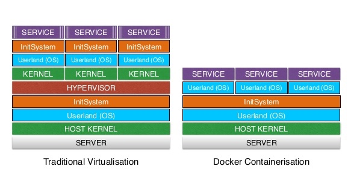
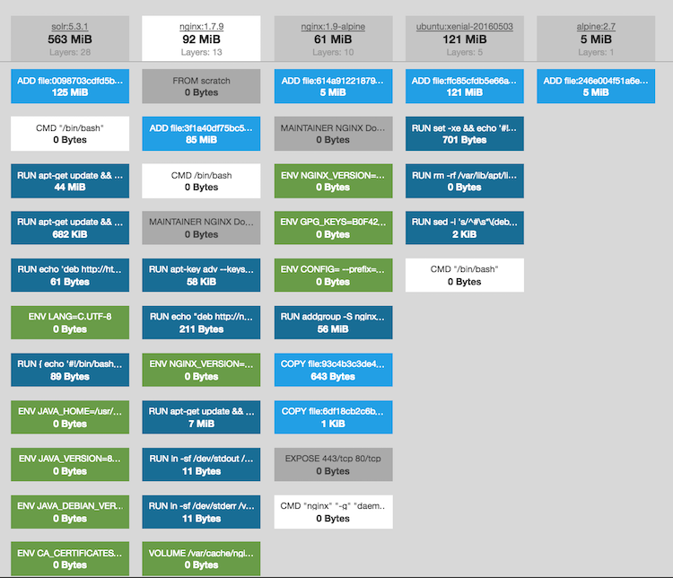

class: center, middle

# Intro to Docker

Follow along locally http://drubin.github.io/tutorials/docker/intro
 

---

# Containers 
### How they differ from Virtual Machines

* Share the same hardware
* Share the same Kernel 
* MUCH lower resources 

 

---

# Layers 

 
---
# Registry

* Remote store of layers/version
* Think of Registry as github
* Think of docker image as github project
* Think of layers as git commits (loosly...)

---

# Syntax 

Base docker with no history
```Dockerfile
FROM scratch
```

Source of `ubuntu:14.04`

```Dockerfile
FROM scratch
ADD ubuntu-trusty-core-cloudimg-amd64-root.tar.gz /
..
```

Your App 
```Dockerfile
FROM ubuntu:16.04
...
```
---

# Hello World

Plan is to build your very own docker image, run it and then explore debugging it

1. Write code
1. Run locally
1. Create a docker image
1. Run the container
1. Stop running the docker image
1. Debug / Explore Docker
1. Share some ports
1. Exec into a container

---

### The code 

1. Lets all create a folder I am going to call it **docker-tut**
1. Lets create a file called **index.html** and fill it with 

```html
<h1>Hello World.</h1>
```

1. Getting running it locally 

```python
python -m SimpleHTTPServer 1984
```

---

### The docker image 

Create a file called **Dockerfile** with the following contents

```Dockerfile
FROM python:2
```

Next we are going to build the image

```
# -t is the tag/name to give the image and . says build the Dockerfile in the current directory
docker build -t docker-tut .
```
--

# You have now offically built your first docker image!!
---

### Making it useful 

Lets adjust your docker image to include some useful bits

```Dockerfile
FROM python:2
WORKDIR /app/
ADD index.html /app/
EXPOSE 1984
CMD [ "python", "-m", "SimpleHTTPServer", "1984"]
```


1. **WORKDIR** Tells the docker image where to execute the commands 

1. **ADD** Tells docker which files to add and where to place them

1. **EXPOSE**  Says your command is going to listen on a PORT that docker should manage

1. **CMD**  Which is the default command to start when running the container

---
## Rebuild

```
docker build -t docker-tut .
```
--
Run the container 

```
docker run  docker-tut 
```
--
Stop the container 

*ctrl+c*

--

Lets expose some ports 

```
docker run -p 1984:1984 docker-tut 
```

**Open your browser up to http://localhost:1984**

--
### Now you really have built your first docker image
---

# Exploring docker 

```
docker ps  
```
```
CONTAINER ID        IMAGE               COMMAND                  CREATED             STATUS              PORTS                    NAMES
423e3f0bbe91        docker-tut          "python -m SimpleH..."   2 minutes ago       Up 2 minutes        0.0.0.0:1984->1984/tcp   fervent_bardeen
```

--
Logging into a container 

```
docker exec -it 423e3f0bbe91 /bin/bash
```

--
```
cat /app/index.html
```

--
```
echo fooo > /app/index.html
```

--
Refresh browser again

--

On the docker terminal tab 

*ctrl+c*
---
## Reset 
```
docker ps 
```
Nothing is running 

--

Lets re-create it
```
docker run -p 1984:1984 docker-tut
```

Open your browser to http://localhost:1984

--

### Wow magic

---


Slides 
http://drubin.github.io/tutorials/docker/intro
 
 --- 
.center[**Thanks**]

